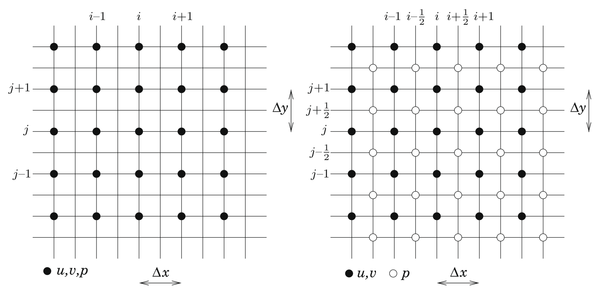
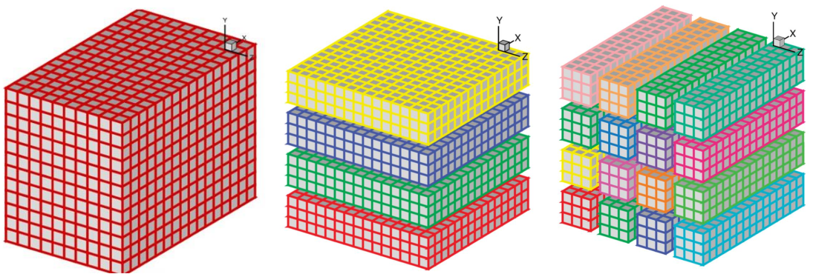

Theoretical Background
======================

Numerical method framework
--------------------------

Governing equations
~~~~~~~~~~~~~~~~~~~

The governing equations are the forced incompressible Navier-Stokes equations:

.. math::
   :label: incomp-ns

   \frac{\partial(\mathbf{u})}{\partial{t}} = -\nabla{p} - \frac{1}{2}[\nabla (\mathbf{u} \otimes \mathbf{u})
   + (\mathbf{u} \cdot \nabla) \mathbf{u}] + \nu \nabla^2\mathbf{u} + \mathbf{f}

.. math::
   :label: div-free

    \nabla \cdot \mathbf{u} = 0

where :math:`\mathbf{u}` is the velocity field, :math:`p` is the pressure field, :math:`\nu` is the kinematic viscosity,
and :math:`\mathbf{f}` is the external force field. Eq. :eq:`incomp-ns` is the momentum equation and  Eq. :eq:`div-free` 
is the incompressibility constraint.

Time advancement
~~~~~~~~~~~~~~~~

The time advancement of Eq. :eq:`incomp-ns` can be expressed as:

.. math::
    :label: time-adv

    &\frac{\mathbf{u}^* - \mathbf{u}^k}{\Delta{t}} = a_k\mathbf{F}^k + b_k\mathbf{F}^{k-1} - c_k\nabla\tilde{p}^k + c_k\tilde{\mathbf{f}}^{k+1} \\
    &\frac{\mathbf{u}^{**} - \mathbf{u}^*}{\Delta{t}} = c_k\nabla\tilde{p}^k\\
    &\frac{\mathbf{u}^{k+1} - \mathbf{u}^{**}}{\Delta{t}} = -c_k\nabla\tilde{p}^{k+1}

with 

.. math::
   :label: incomp-ns-rhs

   \mathbf{F}^k = - \frac{1}{2}[\nabla (\mathbf{u}^k \otimes \mathbf{u}^k)
   + (\mathbf{u}^k \cdot \nabla) \mathbf{u}^k] + \nu \nabla^2\mathbf{u}^k

and

.. math::
    :label: pressure-correction

    \tilde{p}^{k+1} = \frac{1}{c_k\Delta{t}}\int_{t_k}^{t_{k+1}} p\, \mathrm{d}t, \quad \tilde{\mathbf{f}}^{k+1} = \frac{1}{c_k\Delta{t}}\int_{t_k}^{t_{k+1}} \mathbf{f}\, \mathrm{d}t

for a Runge-Kutta scheme with coefficients :math:`a_k`, :math:`b_k`, and :math:`c_k=a_k+b_k` and :math:`n_k` sub-time steps :math:`k=1,\dots{n_k}` with :math:`t_1=t_n` and :math:`t_{n_k} = t_{n+1}`. Pressure and forcing terms are expressed through their time-averaged values on a given sub-step :math:`c_k\Delta{t}`, indicated by the tilde in :math:`\tilde{p}^{k+1}` and :math:`\tilde{\mathbf{f}}^{k+1}`.

Role of intermediate velocities
^^^^^^^^^^^^^^^^^^^^^^^^^^^^^^^

In this approach, we introduce two intermediate velocities :math:`\mathbf{u}^*` and :math:`\mathbf{u}^{**}`. The motivation for using these intermediate steps is to enforce the divergence-free condition at the walls while also satisfying Dirichilet boundary conditions.

First, we compute a velocity field :math:`\mathbf{u}^*` that satisfies the momentum equation without yet enforcing incompressibility. This provides a preliminary estimate of the velocity. Next, we modify :math:`\mathbf{u}^*` by incorporating the pressure gradient from the previous time step :math:`\nabla{p}^k` to obtain :math:`\mathbf{u}^{**}`.

.. math::
    :label: first_vel

    \mathbf{u}^{**}\big|_w = \mathbf{u}^*\big|_w + \Delta{t}\cdot{c_k} \nabla{p}^k

To ensure :math:`\nabla\cdot\mathbf{u}^{k+1}=0` we use the pressure gradient gradient :math:`\nabla{p}^{k+1}` from the current time-step:

.. math::
    :label: second_vel

    \mathbf{u}^{k+1}\big|_w = \mathbf{u}^{**}\big|_w - \Delta{t}\cdot{c_k} \nabla{p}^{k+1}

At the walls, :math:`\mathbf{u}^*\big|_w=0` (no-slip condition for the first intermediate velocity) which when substituted into Eq. :eq:`first_vel` gives:

.. math::
    :label: second_vel2

    \mathbf{u}^{**}\big|_w=\Delta{t}\cdot{c_k}\nabla{p}^K

Therefore, the velocity at the wall in the current time-step is:

.. math::
    :label: wall_vel1

    \mathbf{u}^{k+1}\big|_w =\Delta{t}\cdot{c_k}\left(\nabla{p}^{k}-\nabla{p}^{k+1}\right)

Since for small time steps :math:`\nabla{p}^{k+1}\approx\nabla{p}^{k}` this results in:

.. math::
    :label: wall_vel2

    \mathbf{u}^{k+1}\big|_w\approx{0}

which ensures that the no-slip boundary condition is satisfied.

Boundary conditions
~~~~~~~~~~~~~~~~~~~

The governing equations Eq. :eq:`incomp-ns` and :eq:`div-free` are solved in a computational domain :math:`L_x \times L_y \times L_z` discretised on a Cartesian mesh of :math:`n_x \times n_y \times n_z` nodes. 

At the boundaries of the time periodic, free-slip, no-slip, or open conditions can be applied depending on the flow configuration considered. Period and free-slip boundary conditions can be imposed directly via the spatial discretisation without specific care in time advancements. 

However, the use of Dirichlet conditions on the velocity (for no-slip or open conditions) needs to be defined according to time advancement procedure. Conventional homogeneous Neumann conditions are used to solve the pressure.

Pressure treatment
~~~~~~~~~~~~~~~~~~

The incompressibility condition :eq:`div-free` can be verified at the end of each sub-time step :math:`\nabla\mathbf{u}\cdot\mathbf{u}^{k+1} =0`  through the solving of a Poisson equation:

.. math::
    :label: poisson

    \nabla\cdot\nabla \tilde{p}^{k+1} = \frac{\nabla\cdot\mathbf{u}^{**}}{c_k\Delta{t}}

that provides the estimation of :math:`\tilde{p}^{k+1}` required to perform the pressure correction.

Spatial discretisation
----------------------

Convective and viscous terms
~~~~~~~~~~~~~~~~~~~~~~~~~~~~

Assuming that we have a uniform distribution of :math:`n_x` nodes :math:`x_i` on the domain :math:`[0, L_x]` with :math:`x_i=(i-1)\Delta{x}` for :math:`1\le{i}\le{n_x}`, the first derivative :math:`f'(x)` of the function :math:`f(x)` can be approximated by a finite difference scheme of the form:

.. math::
    :label: first-derivative

    \alpha{f}'_{i-1} + f'_i + \alpha{f}'_{i+1} = a\frac{f_{i+1}-f_{i-1}}{2\Delta{x}} + b\frac{f_{i+2}-f_{i-2}}{4\Delta{x}}

By choosing :math:`\alpha=1/3`, :math:`a=14/9`, :math:`b=1/9` this approximation is sixth-order accurate while having a so-called "quasi-spectral behaviour" due to its capabilities to represent accurately a wide range of scales. The compromise of the sixth-order accuracy has been chosen to maintain a compact formulation via the use of a Hermitian structure of the scheme with :math:`\alpha\ne{0}`. Even though this scheme is twice as expensive as a second-order scheme, in order to get the same solution with second-order scheme will require four to five times more mesh nodes.

Pressure
~~~~~~~~

Convective and diffusive terms are discretised using scheme :eq:`first-derivative` on a collocated mesh whereas a partially staggered mesh is used for the pressure treatment. To evaluate :math:`f'_{i+1/2}` of the first derivative at the staggered nodes by a half-mesh :math:`\Delta{x}/2`, the sixth-order finite-difference scheme can be expressed as:

.. math::
    :label: staggered-first-derivative

    \alpha{f}'_{i-1/2} + f'_{i+1/2} + \alpha{f}'_{i+3/2} = a\frac{f_{i+1}-f_{i-1}}{\Delta{x}} + b\frac{f_{i+2}-f_{i-1}}{3\Delta{x}}

with :math:`\alpha=9/62`, :math:`a=63/62` and :math:`b=17/62`. The spectral behaviour of this scheme is better than its collocated counterpart :eq:`first-derivative`.

    Arrangement of variables in 2D for collocated (left) and partially staggered (right) meshes.

Assuming that :math:`f` is periodic over the domain :math:`[0,L_x]`, the discrete Fourier transform of the function :math:`f` can be expressed as:

.. math::
    :label: dft

    \hat{f}_l = \frac{1}{n_x}\sum_{i=1}^{n_x} f_i e^{-{i}k_xx_i} \quad \mathrm{for} \quad -n_x/2 \le l \le n_x/2-1

where :math:`l=\sqrt{-1}` and :math:`k_x=2\pi{l}/L_x` is the wave number. The inverse discrete Fourier transform is given by:

.. math::
    :label: idft

    f_i = \sum_{l=-n_x/2}^{n_x/2-1} \hat{f}_l e^{i{k_x}x_i}.

It can be shown that the Fourier coefficients :math:`\hat{f}'_l` associated with the approximation :eq:`first-derivative` are linked to the Fourier coefficients :math:`\hat{f}_l` given by :eq:`dft` by the simple spectral relation:

.. math::
    :label: spectral-relation

    \hat{f}'_l = l{k'_x}\hat{f}_l

where :math:`k'_x` is the modified wave number related to the actual wave number :math:`k_x` by

.. math::
    :label: modified-wave-number

    k'_x\Delta{x} = \frac{a\sin(k_x\Delta{x}) + (b/2)\sin(2k_x\Delta{x})}{1+2\alpha\cos(k_x\Delta{x})}

The concept of the modified wave number still holds in the staggered formulation, and the expression of :math:`k'_x` associated with the scheme :eq:`staggered-first-derivative` is given by:

.. math::
    :label: modified-wave-number-staggered

    k'_x\Delta{x} = \frac{2a\sin(k_x\Delta{x}/2) + (2b/3)\sin(3k_x\Delta{x}/2)}{1+2\alpha\cos(k_x\Delta{x})}

The well known principle of equivalence between multiplication in Fourier space and derivation/interpolation in the physical space is recalled here. This equivalence is exact, hence, the computaion of a derivative  in physical space using :eq:`staggered-first-derivative` with relevant boundary conditions must lead to the same result obtained with the use of :eq:`modified-wave-number-staggered` in spectral space.

Solving the Poisson equation
----------------------------

There are several numerical algorithms for solving Poisson's equations, which can be broadly classified into two categories: iterative solvers and direct solvers. Among the direct methods, Fast Fourier Transform (FFT) based solvers are the most efficient. 

For simplicity, a generic 3D Fourier transform can be defined as:

.. math::
    :label: 3d-dft

    \hat{p}_{lmn} = \frac{1}{n_xn_yn_z}\sum_{i}\sum_{j}\sum_{k} p_{ijk} W_x(k_xx_i)W_y(k_yy_j)W_z(k_zz_k)

with its inverse expression

.. math::
    :label: 3d-idft

    \hat{p}_{ijk} = \sum_{l}\sum_{m}\sum_{n} \hat{p}_{lmn} W_x(-k_xx_i)W_y(k_yy_j)W_z(k_zz_k)

where the sums, the base functions :math:`(W_x, W_y, W_z)` and the wave numbers :math:`(k_x, k_y, k_z)` can correspond to standard FFT (for periodic boundary conditions) or cosine FFT (for free-slip or :math:`\mathbf{u}`-Dirichlet/:math:`p`-Neumann boundary conditions) in their collocated or staggered versions. 3D direct :eq:`3d-dft` and inverse :eq:`3d-idft` can be performed with any efficient FFT routines availbale in scientific Fortran or C libraries. The first stage in solving the Poissin equation :eq:`poisson` consists in the computation of its right hand side. After performing the relevant Fourier transform :eq:`3d-dft` to :math:`D=\nabla\cdot\mathbf{u}^{**}`, the solving of the Poisson equation consists in a single division of each Fourier mode :math:`\hat{D}_{lmn}` by  a factor :math:`F_{lmn}` with

.. math::
    :label: poisson-solve

    \hat{\tilde{p}}^{k+1}_{lmn} = \frac{\hat{D}_{lmn}}{F_{lmn}}

where the expression of this factor depends on the mesh configuration. For instance, in the case of a partially staggered approach, the factor :math:`F_{lmn}` must take the mid-point interpolation into account through the use of a transfer function with the following form:

.. math::
    :label: staggered-factor

    F_{lmn} = -[(k'_xT_yT_z)^2 + (k'_yT_xT_y)^2 + (k'_zT_xT_y)^2]c_k\Delta{t}

where :math:`T_x(k_x\Delta{x})` is the transfer function related to the wave number :math:`k_x` by

.. math::
    :label: transfer-function

    T_x(k_x\Delta{x}) = \frac{2a\cos(k_x\Delta{x}/2) + (2b/3)\cos(3k_x\Delta{x}/2)}{1+2\alpha\cos(k_x\Delta{x})}

Stretched mesh in one direction
~~~~~~~~~~~~~~~~~~~~~~~~~~~~~~~

The pressure discretisation described so far is only valid for a regular mesh in three spatial directions. To overcome this difficulty a modification of the Poisson solver is proposed which is based on a specific function mapping and expressed using only few Fourier modes. This approach preserves the spectral and non-iterative nature of the pressure treatment without significant loss of accuracy. 

For simplicity consider a one-dimensional problem where :math:`y` is the physical coordinate and :math:`s` is the computational coordinate:

.. math::
    :label: mapping

    y = h(s), \quad 0\le{s}\le{1}, 0\le{y}\le{L_y}

where :math:`h(s)` is the mapping from equally spaced coordinate :math:`s` to the stretched physical coordinate :math:`y`. The derivatives with respect to :math:`y` can be estimated using the chain rule, where the first derivative is given by:

.. math::
    :label: first-derivative-mapping

    \frac{\partial{f}}{\partial{y}} = \frac{\partial{f}}{\partial{s}}\frac{\partial{s}}{\partial{y}} = \frac{1}{h'(s)}\frac{\partial{f}}{\partial{s}}

and the second derivative is given by:

.. math::
    :label: second-derivative-mapping

    \frac{\partial^2{f}}{\partial{y}^2} = \frac{\partial^2{f}}{\partial{s^2}}\left(\frac{\partial{s}}{\partial{y}}\right)^2 + \frac{\partial{f}}{\partial{s}}\frac{\partial^2{s}}{\partial{y^2}} = \frac{1}{h'(s)^2}\frac{\partial^2{f}}{\partial{s}^2} - \frac{h''(s)}{h'(s)^3}\frac{\partial{f}}{\partial{s}}

Expressed in physical space, these rules can be used to implement schemes like :eq:`first-derivative` and :eq:`staggered-first-derivative` where the finite differences are performed on the regular coordinate :math:`s` (instead of :math:`x`). 

The main difficulty is in the treatment of the Poisson equation that requires similar operations in the spectral space. Here the metric :math:`1/h'` is expressed with only three Fourier modes in spectral space:

.. math::
    :label: truncated-metric

    \frac{1}{h'} = \frac{1}{L_y}\left\{ \frac{\alpha}{\pi} + \frac{1}{\pi\beta}\sin^2(\pi(\gamma{s} + \delta))\right\}  = \frac{1}{L_y}\left\{ \frac{\alpha}{\pi} + \frac{1}{2\pi\beta}\left[1-\frac{e^{l2\pi(\gamma{s}+\delta)} + e^{-l2\pi(\gamma{s}+\delta)}}{2}\right]\right\}

so that the mapping :eq:`mapping` can be written as:

.. math::
    :label: fourier-mapping-metric

    \begin{align}
    h &= \frac{L_y\sqrt{\beta}}{\gamma\sqrt\alpha\sqrt{\alpha\beta+1}}\left\{\tan^{-1}\left[\frac{\sqrt{\alpha\beta+1}\tan(\pi(\gamma{s}+\delta))}{\sqrt\alpha\sqrt\beta}\right] \right. \\
    &+ \left. \pi\left[H\left(s-\frac{1-2\delta}{2\gamma}\right) + H\left(s-\frac{3-2\delta}{2\gamma}\right)\right] -\tan^{-1}\left[\frac{\sqrt{\alpha\beta+1} +\tan(\pi\delta)}{\sqrt\alpha\sqrt\beta}\right]   \right\}
    \end{align}

where :math:`H` is the Heaviside step function. This mapping preserves the accuracy while avoiding expensive computation of a full convolution and ensuring the strict physical/spectral equivalence.

* :math:`\alpha=0`, :math:`\gamma=1` and :math:`\delta=0` the mapping leads to refinement in the centre of an infinite domain
* :math:`\alpha\ne{0}`, :math:`\gamma=1` and :math:`\delta=0` leads to refinement in the centre of a finite domain
* :math:`\gamma=1` and :math:`\delta=1/2` leads to refinement near the boundaries for a finite domain (not compatible with periodic boundary conditions) because :math:`1/h'` is not periodic over :math:`L_y`
* :math:`\gamma=1/2` and :math:`\delta=1/2` leads to refinement near the bottom boundary only for a finite domain

It can be deduced that the three coefficients of the metric :eq:`fourier-mapping-metric` are non-zero with

.. math::
    :label: metric-coefficients

    \alpha = \frac{1}{L_y}\left(\frac{\alpha}{\pi} + \frac{1}{2\pi\beta}\right), \quad \hat{a}_1 = \hat{a}_{-1}  = -\frac{1}{L_y}\left(\frac{\cos{2\pi\delta}}{4\pi\beta}\right)

for :math:`\gamma=1` and :math:`\delta=0` or :math:`1/2`. The main advantage of this compact expression in spectral space is that the convolution of the metric by the first derivation with respect to the regular coordiate :math:`s` requires only :math:`3n_y` multiplications.

To solve the Poisson equation :eq:`poisson` (using 3D Fourier transforms :eq:`3d-dft` and :eq:`3d-idft` where :math:`y` needs to be substituted by :math:`s` for the :math:`y`-stretched approach) the counter part of the integration scheme :eq:`poisson-solve` becomes

.. math::
    :label: poisson-solve-stretched

    \hat{\tilde{\mathbf{p}}}_{ln}^{k+1} = \mathbf{B}^{-1}\widehat{\mathbf{D}}_{ln}

where :math:`\hat{\tilde{\mathbf{p}}}_{ln}^{k+1}` and :math:`\widehat{\mathbf{D}}_{ln}` are :math:`n_y` vectors of components of :math:`\hat{\tilde{p}}_{ln}^{k+1}` and :math:`\widehat{D}_{ln}` and :math:`\mathbf{B}` is a :math:`n_y \times n_y` pentadiagonal matrix of components. For the partially staggered case these components are:

.. math::
    :label: pentadiagonal-matrix

    &b_{m,m-2} = -\hat{a}_1^2T_x^2T_z^2k'_{m-1}k'_{m-2} \\
    &b_{m,m-1} = -\hat{a}_0\hat{a}_1^2T_x^2T_z^2k'_{m-1}(k'_m + k'_{m-1}) \\
    &b_{m,m} = -(k'_xT_yT_z)^2 - (k'_zT_yT_z)^2 -\hat{a}^2_0T_x^2T_z^2{k'_m}^2 - \hat{a}_1\hat{a}_{-1}T_x^2T_z^2k'_m(k'_{m+1} + k'_{m-1}) \\
    &b_{m,m+1} = -\hat{a}_0\hat{a}_1T_x^2T_z^2k'_{m+1}(k'_m + k'_{m+1}) \\
    &b_{m,m+2} = -\hat{a}_{-1}^2T_x^2T_z^2k'_{m+1}k'_{m+2}

where the :math:`k'_m` are the modified wave numbers from relation like :eq:`modified-wave-number` or :eq:`modified-wave-number-staggered` based on the computational coordinate :math:`s` instead of :math:`x`. 

The above matrix is diagonal for a regular :math:`y`-coordinate (with :math:`a_1=a_{-1}=0`) so that the simplified expression :eq:`transfer-function` can be recovered. In the other cases, the computation of pressure nodes :math:`\hat{\tilde{\mathbf{p}}}_{ln}^{k+1}` requires to invert :math:`n_x \times n_y` linear systems based on :math:`n_y\times{n_y}` pentadiagonal matrices. The corresponding computational cost is proportional to :math:`n_x\times{n_y}\times{n_z}` so that the solver Poisson can be direct without any iterative process.

In terms of computational cost, solving the Poisson equation directly requires both a forward and an inverse 3D FFT. For a completely regular mesh in three spatial dimensions, these two FFT operations constitute majority of the computational expense for the Poisson stage, accounting for about 10% of the total computational effort required to solve the Navier-Stokes equations. When dealing with meshes that have one stretched direction, the cost of ensuring incompressibility increases but still represents about 15% of the overall computational cost for a given simulation.

Although using Fourier transforms for pressure is highly suitable for periodic or free-slip boundary conditions, it is less ideal for no-slip or open boundary conditions. In these cases the pressure must be expressed using consine Fourier transforms, assuming that homogeneous Neumann conditions are met. This assumption introduces an error that is only second-order accurate in space.

Tridiagonal systems solver algorithm
------------------------------------

The framework used here requires solving up to 150 batches of tridiagonal systems at each time step to compute derivatives and interpolations using implicit high-order finite-difference schemes. The ability of software to exploit exascale systems depends on the scalability of numerical simulation applications and their underlying algorithms.

Tridiagonal systems solvers are needed to solve system of linear equations of the form :math:`Ax=d`, where :math:`a_0=c_{N-1}=0`

.. math::
    :label: tdsops1

    a_iu_{i-1} + b_iu_i + c_iu_{i+1} = d_i \quad i=0,1,\dots,N-1

The Thomas algorithm is a well-known method for solving tridiagonal systems of equations. It is a specialised form of Gaussian elimination that involves a forward pass to eliminate the lower diagonal elements :math:`a_i` of the tridiagonal matrix, by adding a multiple of the row above. This is followed by a backward pass using the modified :math:`c_i` values from the last index to the first. This algorithm is inherently serial as each iteration of the loop has a dependency on the previous one, taking :math:`2N` steps.

In contrast, the parallel cyclic reduction (PCR)  is inherently parallel, allowing multiple threads to solve each tridiagonal system simultaneously, as the iterations of the inner loop do not depend on each other. Although the PCR algorithm is computationally more expensive than the Thomas algorithm, it is well-suited for modern multicore/many-core architectures with high computational capabilities.

In x3d2, a hybrid algorithm combinining Thomas with PCR is implemented, as it has been shown to perform best on GPUs. This hybrid algorithm has a key advantage that, up to a certain system size, the entire subsystem can be stored in the registers of a warp (32 CUDA threads that executes the same instruction simultaneously).

2D domain decomposition
-----------------------

For many applications that solve differential equations on three-dimensional Cartesian meshes, the numerical algorithms are inherently implicit. A compact finite difference scheme such as those described above, results in solving a tridiagonal linear system when evaluating spatial derivatives or interpolations. A spectral code often involves performing Fast Fourier Transforms along global mesh lines.

There are two approaches to performing such computations on distributed-memory systems. One can either develop distributed algorithms (such as a parallel tridiagonal solver or parallel FFT working on distributed data), or dynamically redistribute (transpose) data among processors to apply serial algorithms in local memory. The second approach is often preferred due to its simplicity.

Many applications have implemented this idea using 1D domain decomposition. However, 1D decomposition has some limitations. For example, for a cubic mesh size of :math:`N^3` the maximum number of processors :math:`N_{\mathrm{proc}}` that can be used in a 1D decomposition is :math:`N` as each slab must contain at least one plane. For a cubic mesh of 1 billion points, this constraint is :math:`N_{\mathrm{proc}} \lt 10^4`. This limitation can be overcome by using 2D domain decomposition.

    3D Cartesian domain (left), 1D domain decomposition (middle), 2D domain decomposition (right).

While a 1D decomposition algorithm swaps between two states, in a 2D decomposition one needs to traverse three different states using four global transpositions to complete a cycle. The swapping between states can be achieved using `MPI_ALLTOALL(V)` library.

2D domain decomposition is widely used for spectral codes, particularly those that are compatible with implicit schemes in space. This method allows for efficient parallelisation by dividing the computational domain into smaller subdomains, each handled by a separate processor. For a simulation with a cubic mesh of size :math:`N^3` up to :math:`N^2` procesors can be used, which significantly increases the scalability compared to 1D decomposition. 

`x3d2` uses the `2DECOMP` library for 2D decomposition. One of the key advantages of using this library is that it does not require modifications to the existing derivative and interpolation subroutines, making it easier to implement. Additionally, this approach utilises customised global `MPI_ALLTOALL(V)` transpositions to redistribute data among processors. Although communication overhead can range from 30% to 80% of the total computational time, with up to 70 transpositions per time step, the overall efficiency and scalability of the simulations are greatly enhanced.

The flowchart below shows the solver processes and the swapping between pencils at different stages of the solution. The swapping between pencils is essential for performing computations along each dimension, such as calculating X-derivatives. When a global operation is performed, the data need to be swapped between different pencil orientations.

.. graphviz::

    digraph SolverFlowchart {
        graph [rankdir=TB, splines=ortho ];

        # default style for process steps
        node [shape=box, style=filled, fillcolor=lightgrey, fontname="Arial", fontsize=12];

        # process steps
        Initialisation        [label="Initialisation"];
        ConvectionDiff        [label="Convection/Diffusion"];
        TimeAdvancement       [label="Time Advancement"];
        VelocityDivergence    [label="Velocity Divergence"];
        PressurePoisson       [label="Pressure Poisson"];
        PressureGradient      [label="Pressure Gradient"];
        VelocityCorrection    [label="Velocity Correction"];
        IOFinalise            [label="I/O, Finalise"];

        # define annotations
        node [shape=plaintext, style="", fillcolor="", fontname="Arial", fontsize=12];

        Start                [label="Start in X"];
        Swap1                [label="X->Y->Z->Y->X\n(24 global operations)"];
        Swap2                [label="No swap"];
        Swap3                [label="X->Y->Z\n(16 global operations)"];
        Swap4                [label="Stay in Z\n(4 global operations, up to 16 depending BC)"];
        Swap5                [label="Z->Y->X\n(5 global operations)"];
        Swap6                [label="No swap"];
        ExtraOps             [label="+(extra 6 global operations if check divergence free)"];

        # define strict vertical process flow
        Initialisation     -> ConvectionDiff     [style=invis]; 
        ConvectionDiff     -> TimeAdvancement    [style=invis];
        TimeAdvancement    -> VelocityDivergence [style=invis];
        VelocityDivergence -> PressurePoisson    [style=invis];
        PressurePoisson    -> PressureGradient   [style=invis];
        PressureGradient   -> VelocityCorrection [style=invis];
        VelocityCorrection -> IOFinalise         [style=invis];
       
        # align annotations
        { rank=same; Initialisation; Start }
        { rank=same; ConvectionDiff; Swap1 }
        { rank=same; TimeAdvancement; Swap2 }
        { rank=same; VelocityDivergence; Swap3 }
        { rank=same; PressurePoisson; Swap4 }
        { rank=same; PressureGradient; Swap5 }
        { rank=same; VelocityCorrection; Swap6 }
        { rank=same; IOFinalise; ExtraOps }

        # connect annotations
        Initialisation      ->  Start    [style=invis];
        ConvectionDiff      ->  Swap1    [style=invis];
        TimeAdvancement     ->  Swap2    [style=invis];
        VelocityDivergence  ->  Swap3    [style=invis];
        PressurePoisson     ->  Swap4    [style=invis];
        PressureGradient    ->  Swap5    [style=invis];
        VelocityCorrection  ->  Swap6    [style=invis];
        IOFinalise          ->  ExtraOps [style=invis];

        # time loop
        VelocityCorrection -> ConvectionDiff [
                color="darkblue", 
                style=dashed, 
                constraint=false, 
                tailport=w, 
                headport=w,
                arrowhead=normal]; 

        # time loop label
        TimeLoopLabel [shape=plaintext, label=< Time Loop >];
        { rank=same; TimeLoopLabel; PressurePoisson; }
        TimeLoopLabel -> PressurePoisson [style=invis];
        
        # add real (visible) edges for the process flow
        Initialisation     -> ConvectionDiff;
        ConvectionDiff     -> TimeAdvancement;
        TimeAdvancement    -> VelocityDivergence;
        VelocityDivergence -> PressurePoisson;
        PressurePoisson    -> PressureGradient;
        PressureGradient   -> VelocityCorrection;
        VelocityCorrection -> IOFinalise;
    }
